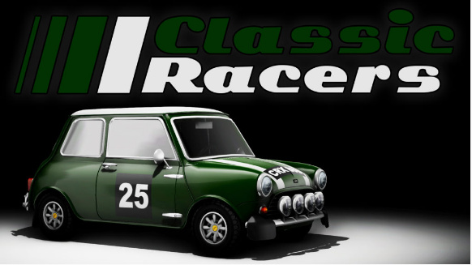
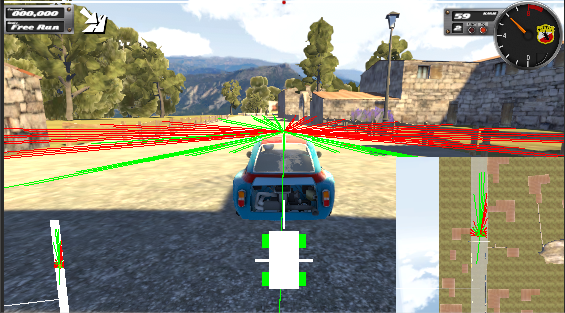

# Reinforcement Learning Classic Racers project

  
  Classic Racers is a game from Vision Réelle.
  It's built on Unity and it's a great realistic environment for self driving car using Unity mlagents
 

# Will you be able to tame Bartha495 ?

  

1) follow installation instructions on https://github.com/Unity-Technologies/ml-agents
  

  

2) download ...
  

    

3) tune yaml file ...
  

  

4) launch training ...
  

[
