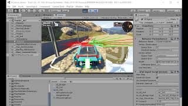

# Reinforcement Learning Classic Racers project

  
  Classic Racers is a game from Vision Réelle.
  It's built on Unity and it's a great realistic environment for self driving car using Unity mlagents
 

# tame Bartha495 with Raycats + PPO ?

  

1)  follow installation instructions on https://github.com/Unity-Technologies/ml-agents
  

  

2) get a Unity built
  

    

3) tune yaml file
  

  

4) launch training
  see first results with 
  
    

